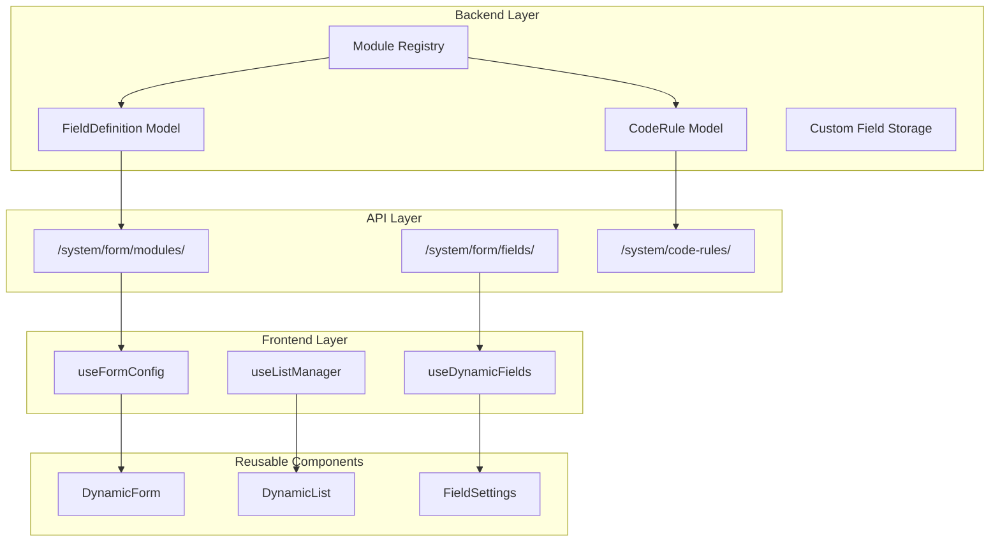

# Universal Dynamic Form Management System

## Current State Analysis

The system already has a solid foundation:

**Backend** ([backend/apps/system/form_models.py](backend/apps/system/form_models.py)):

- `FieldDefinition` - Complete dynamic field model with 15+ field types
- `FieldGroup` - Field grouping support
- `ModuleFormConfig` - Module-level API and permission configuration

**Frontend**:

- `useFormConfig` ([frontend/src/composables/useFormConfig.js](frontend/src/composables/useFormConfig.js)) - Form configuration service
- `useListToolbar` ([frontend/src/composables/useListToolbar.js](frontend/src/composables/useListToolbar.js)) - Search, filter, pagination
- `DynamicForm` ([frontend/src/components/form/DynamicForm.vue](frontend/src/components/form/DynamicForm.vue)) - Config-driven form dialog
- `FieldRenderer` ([frontend/src/components/form/FieldRenderer.vue](frontend/src/components/form/FieldRenderer.vue)) - Field type renderer

**Key insight**: The `module` field is already a generic string - it can be "asset", "supply", "user", "department", "purchase_order", etc.

---

## Architecture Overview



---

## Implementation Plan

### Phase 1: Backend - Module Registry and Auto-Initialization

**1.1 Create Module Registry** (`backend/apps/system/module_registry.py`)

Define all system modules with their default system fields:

```python
MODULE_REGISTRY = {
    'asset': {
        'label': '资产',
        'api_base': '/api/assets/list/',
        'code_rule_prefix': 'ZC',
        'system_fields': [
            {'field_key': 'asset_code', 'field_name': '资产编号', 'field_type': 'code', 'is_required': True},
            {'field_key': 'name', 'field_name': '资产名称', 'field_type': 'text', 'is_required': True},
            # ... more fields
        ]
    },
    'supply': {
        'label': '办公用品',
        'api_base': '/api/consumables/list/',
        'code_rule_prefix': 'BG',
        'system_fields': [...]
    },
    'user': {
        'label': '用户',
        'api_base': '/api/auth/users/',
        'system_fields': [...]
    },
    'department': {
        'label': '部门',
        'api_base': '/api/organizations/departments/',
        'system_fields': [...]
    },
    'purchase_order': {
        'label': '采购订单',
        'api_base': '/api/procurement/orders/',
        'code_rule_prefix': 'PO',
        'system_fields': [...]
    },
    # ... more modules
}
```

**1.2 Add Custom Fields Storage to Models**

Add a JSONField to store custom field values on any model:

```python
class BaseModel(models.Model):
    # ... existing fields
    custom_fields = models.JSONField('自定义字段', default=dict, blank=True)
    
    class Meta:
        abstract = True
```

**1.3 Create Management Command for Field Initialization**

```bash
python manage.py init_module_fields --module=all
```

---

### Phase 2: Backend - Generic ViewSet Mixin

**2.1 Create DynamicFieldsMixin** (`backend/apps/system/mixins.py`)

A mixin that adds custom field handling to any ViewSet:

```python
class DynamicFieldsMixin:
    """Mixin to handle dynamic/custom fields for any model"""
    
    module_name = None  # Override in subclass
    
    def get_serializer_class(self):
        # Dynamically add custom fields to serializer
        ...
    
    def perform_create(self, serializer):
        # Extract and save custom field values
        ...
```

---

### Phase 3: Frontend - Reusable Components

**3.1 Create `DynamicList` Component** (`frontend/src/components/list/DynamicList.vue`)

A config-driven list component with search, filters, column settings:

```vue
<DynamicList
  module="asset"
  :actions="['create', 'edit', 'delete', 'export']"
  @row-click="handleRowClick"
/>
```

**3.2 Create `FieldSettings` Component** (`frontend/src/components/form/FieldSettings.vue`)

Reusable component for managing custom fields for any module:

```vue
<FieldSettings module="supply" />
```

**3.3 Create `useDynamicModule` Composable** (`frontend/src/composables/useDynamicModule.js`)

Combines all module-related functionality:

```javascript
export function useDynamicModule(moduleName) {
  const { formConfig, loadFormConfig } = useFormConfig(moduleName)
  const { fields, loadFields, saveField } = useDynamicFields(moduleName)
  const { codeRule, loadCodeRule, generateCode } = useCodeRule(moduleName)
  
  return {
    formConfig,
    fields,
    codeRule,
    // ... methods
  }
}
```

---

### Phase 4: Integration Examples

**4.1 User Module** - Minimal code needed:

```vue
<!-- views/system/users/index.vue -->
<template>
  <DynamicList module="user" />
</template>
```

**4.2 Department Module**:

```vue
<template>
  <DynamicList module="department" :tree-mode="true" />
</template>
```

**4.3 Purchase Order Module**:

```vue
<template>
  <DynamicList 
    module="purchase_order"
    :workflow="true"
    :actions="['create', 'edit', 'submit', 'approve', 'reject']"
  />
</template>
```

---

## File Changes Summary

### Backend Files to Create/Modify:

- `backend/apps/system/module_registry.py` - Module definitions (NEW)
- `backend/apps/system/mixins.py` - DynamicFieldsMixin (NEW)
- `backend/apps/system/management/commands/init_module_fields.py` - Init command (NEW)
- `backend/apps/common/models.py` - Add custom_fields to BaseModel
- `backend/apps/system/form_views.py` - Enhanced API for module config

### Frontend Files to Create/Modify:

- `frontend/src/components/list/DynamicList.vue` - Generic list (NEW)
- `frontend/src/components/form/FieldSettings.vue` - Field management (NEW)
- `frontend/src/composables/useDynamicModule.js` - Combined composable (NEW)
- `frontend/src/composables/useCodeRule.js` - Code rule composable (NEW)

---

## Benefits

- **DRY Principle**: Define fields once, use everywhere
- **Consistency**: All modules share the same UI/UX patterns
- **Extensibility**: Add new modules with minimal code
- **Maintainability**: Changes to core components affect all modules
- **User Customization**: End users can add custom fields without code changes