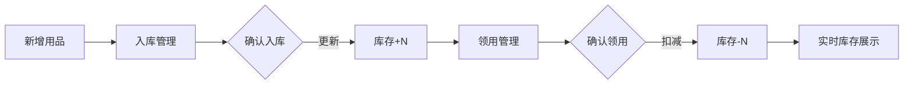

# 办公用品业务闭环开发文档

## 功能概述

本次开发完善了办公用品模块的业务闭环，实现了入库管理、领用管理与库存数据的完整联动。

## 变更清单

### 后端变更

#### `backend/apps/consumables/serializers.py`

| 变更项 | 说明 |
|--------|------|
| `total_stock` 字段 | 新增聚合字段，统计用品在所有仓库的总库存 |
| `get_total_stock()` | 使用 `Sum()` 聚合确保数据准确性 |

**业务逻辑确认**:
- 入库审批 (`approve`) → 增加库存 ✅
- 领用审批 (`approve`) → 扣减库存 ✅
- 库存不足校验 ✅

### 前端变更

| 文件 | 变更内容 |
|------|----------|
| `inbound/index.vue` | 查看详情对话框、编辑数据加载 |
| `outbound/index.vue` | 查看详情对话框、编辑数据加载 |
| `list/index.vue` | 公司参数传递、total_stock 显示 |

## 业务流程

## 测试说明

### 测试环境
- 前端: http://localhost:3000/
- 后端: http://localhost:8000/api/
- 账号: admin / admin123

### 测试用例

1. **入库→库存更新**
   - 创建入库单并确认
   - 验证库存数量增加

2. **领用→库存扣减**
   - 创建领用单并确认
   - 验证库存数量减少

3. **库存预警**
   - 设置安全库存阈值
   - 验证低库存警告显示

## 开发规范遵循

- ✅ 所有业务逻辑在 `views.py` 使用 `@transaction.atomic`
- ✅ 使用 `select_related` / `prefetch_related` 优化查询
- ✅ 前端组件脚本未超过500行
- ✅ API响应使用统一格式
